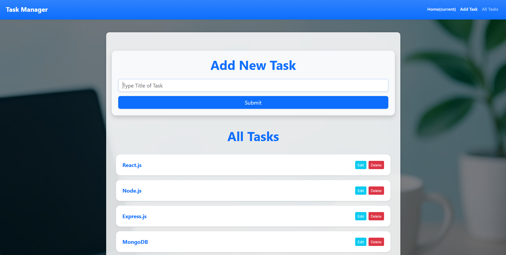

# 📝 Task Manager App - React

A simple and elegant **Task Manager App** built with **React**, allowing users to manage their tasks efficiently with a smooth user interface and modern design.

---

## 🚀 Live Demo

🌐 **Check the app live here:**  
🔗 [https://task-manager-react-azure.vercel.app/](https://task-manager-react-azure.vercel.app/)

---

## ✅ Features

- 🆕 Add New Tasks
- 🗑️ Delete Tasks
- ✏️ Edit Tasks (function ready to extend)
- 💾 LocalStorage Support
- 🎨 Stylish UI with Bootstrap
- ⚛️ Context API for state management
- 📱 Responsive Design

---

## 🧪 Technologies Used

- React JS
- React Router DOM
- Bootstrap 5
- Context API
- LocalStorage
- Vercel (for deployment)
